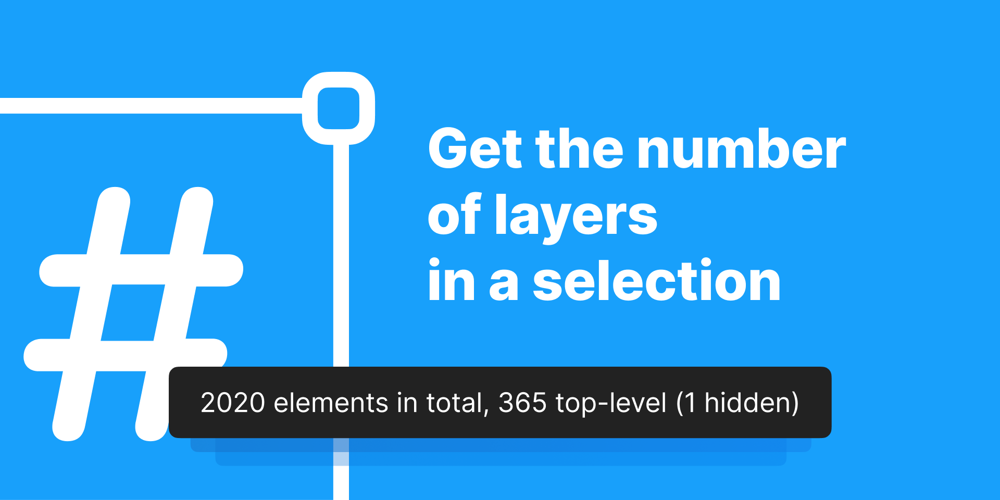
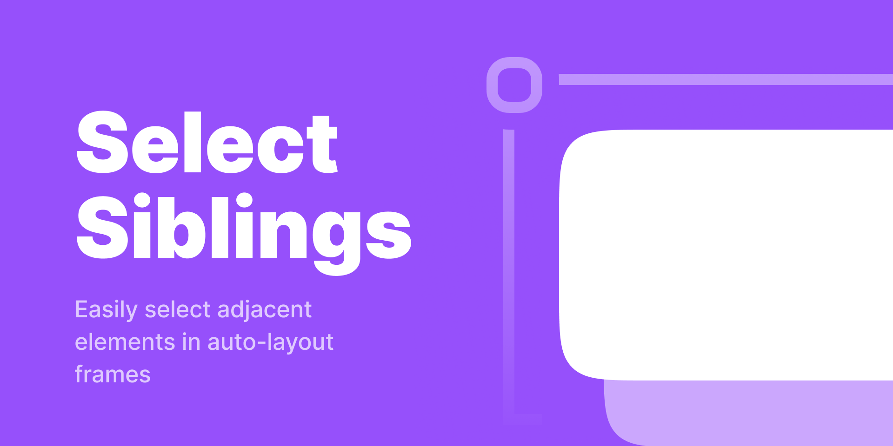

# Figma Plugin Boilerplate

> A template for Figma plugins with user interfaces


The template provides both the backend and frontend (UI) of the plugin. The UI is built with React and [Vite](https://vitejs.dev) handle it, while [esbuild](https://esbuild.github.io) builds the backend. The sample plugin inside draws rectangles on the canvas when the user clicks a button.

## Built with This Template

| | Plugin | What it does | Users |
| --- | --- | --- | --- |
| [](https://www.figma.com/community/plugin/900867721222656652/Count-Layers) | **[Count Layers](https://www.figma.com/community/plugin/900867721222656652/Count-Layers)** | Counts the layers in a selection and shows how many are top-level or hidden | **6.5k** |
| [](https://www.figma.com/community/plugin/1108861824194364527/Toggle-Clip-Content) | **[Toggle Clip Content](https://www.figma.com/community/plugin/1108861824194364527/Toggle-Clip-Content)** | Switches an element’s clipping mode, so it can be bound to a keyboard shortcut | **2.1k** |
| [](https://www.figma.com/community/plugin/1023271295543606907/Select-Siblings-in-Auto-Layout) | **[Select Siblings in Auto-Layout](https://www.figma.com/community/plugin/1023271295543606907/Select-Siblings-in-Auto-Layout)** | Selects the elements sitting on the same level of an auto-layout frame | **900** |

## Template Structure
The backend logic and the UI live in two separate folders and can be worked on independently. Each folder has its own `tsconfig.json` and a config for its bundler: `/plugin` holds the esbuild configuration, `/ui` holds the Vite settings.

`plugin/index.ts` is the entry point for the backend, `ui/main.tsx` is the one for the UI. Both folders take extra files and subfolders as a plugin grows — just adjust the configs if an entry point moves.

## Environment Variables
An environment variable is a setting that lives next to the code instead of inside it. It sits in `.env`, a file git ignores, and the code refers to it by name.

Take a plugin that calls an API. The address goes into `.env` as `API_URL`. Switching from a test server to the real one before publishing is then a one-line edit, and the plugin code stays untouched.

One limit: the value ends up in the built bundle as plain text. Anyone who downloads the published plugin can read it, so `.env` holds settings, **not secrets**.

Figma runs plugin code in a sandbox that has no Node.js, so there is no `process.env` to read there. The values have to be inside the code before it ships. The build does that with a find-and-replace. esbuild looks for the text `process.env.EXAMPLE_API_KEY` in the source and swaps it for the value taken from `.env`. Nothing is read at runtime — by the time the plugin runs, the variable is already a plain string in the bundle.

### Adding a Variable
Add the value to `.env`:
   ```
   MY_VARIABLE="some-value"
   ```

--- 

Add the name to the `define` map in `plugin/esbuild.mjs`, so esbuild knows what to look for:
   ```js
   define: {
       'process.env.MY_VARIABLE': JSON.stringify(process.env.MY_VARIABLE)
   }
   ```

---

Add the type to `plugin/environment.d.ts`, so TypeScript accepts the reference:
   ```ts
   const process: {
       env: {
           MY_VARIABLE?: string
       }
   }
   ```
---

Use `process.env.MY_VARIABLE` anywhere in the plugin code:
   ```ts
   figma.notify(`Running with ${process.env.MY_VARIABLE}`)
   ```

---

## Development Process
The project needs Node.js 24 or newer: `--env-file` and npm’s `min-release-age` setting both depend on it.

1. Clone this repository and run `npm install`.
2. In Figma, go to `Plugins` → `Development` → `New Plugin…` and enter a name. It can be any string, nothing uses it later.
3. On the same screen, choose the plugin type: either `Figma design + FigJam` or just `Figma design`. Click “Next”.
4. Figma offers three templates: `Empty`, `Run once` and `With UI & browser APIs`. We’re writing the plugin from scratch, so pick any of them.
5. Click “Save as” and choose a temporary folder for Figma’s output.
6. Open that folder, find `manifest.json` and copy the `id` and `editorType` values into the `manifest.json` in the cloned repository.
7. Back in Figma, go to `Plugins` → `Manage Plugins…`, find the newly created plugin and remove it.
8. Go to `Plugins` → `Development` → `Import plugin from manifest…` and select `manifest.json` *stored in this repository*.
9. Write some code, then run `npm run dev` to watch it or `npm run build` to produce a production bundle.

## References
1. [Figma’s introduction to plugin development](https://www.figma.com/plugin-docs/intro/)
2. [API Reference](https://www.figma.com/plugin-docs/api/api-overview/)
